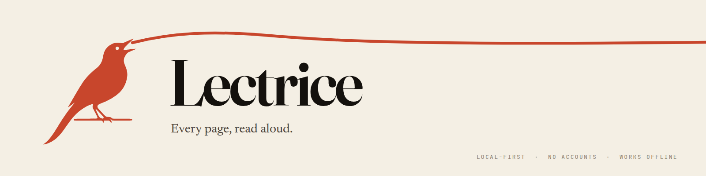

<p align="center">
  
</p>

# Lectrice

> Every page, read aloud.

**Lectrice** is a local-first desktop PDF reader that reads documents aloud —
highlight a passage, press play, and let it continue across pages. Built with
Tauri 2.x (React/TypeScript + Rust).

[**Download for Linux**](https://github.com/phsb5321/Tauri-PDF-Reader/releases/latest)
· [First read](#your-first-read)
· [Speech and privacy](#ai-text-to-speech)
· [Known limitations](docs/KNOWN_LIMITATIONS.md)

**Reading and highlighting work offline. Narration is a separate setup step.**
The published v0.2.0 release uses your ElevenLabs API key for speech; provider
charges may apply. It sends the text requested for narration to ElevenLabs, not
just audio commands. Current source also has other provider paths; see below.

The name is French for _a person employed to read aloud to someone_ — the app
is your lectrice. See [`docs/brand/`](docs/brand/) for the full brand system.

> **Version:** 0.2.0. Linux AppImage/deb artifacts come from tagged commits
> under [Releases](https://github.com/phsb5321/Tauri-PDF-Reader/releases).
> Apple-silicon macOS has a personal Nix flake channel with exact bundle/launch
> verification and profile rollback; it is ad-hoc signed, not a public
> notarized distribution. See [CHANGELOG.md](CHANGELOG.md),
> [docs/macos-nix.md](docs/macos-nix.md), and
> [docs/KNOWN_LIMITATIONS.md](docs/KNOWN_LIMITATIONS.md).

## Your first read

### 1. Install a published build

For **Linux x86-64**, open [Releases](https://github.com/phsb5321/Tauri-PDF-Reader/releases/latest)
and choose the `.AppImage` or `.deb` asset. For the published v0.2.0 AppImage,
run these commands in the directory where you downloaded it:

```bash
chmod +x Lectrice_0.2.0_amd64.AppImage
./Lectrice_0.2.0_amd64.AppImage
```

These commands are version-specific; use the matching filename for a later
release. The `.deb` is the Debian/Ubuntu package alternative. NixOS users should
use an appropriate AppImage compatibility environment or build from source;
the AppImage is not a native NixOS package.

For **Apple-silicon macOS**, use the separate [Nix installation guide](docs/macos-nix.md).
There is no public notarized macOS installer or Windows download.

### 2. Read without connecting a speech provider

Open a local PDF with **Ctrl+O**, select a passage, and highlight it. Use a PDF
with selectable text for this first try. You do not need an API key to view,
highlight, or return to your reading position.

### 3. Add narration when you want it

In **v0.2.0**, open **TTS Settings** from the playback bar, enter your ElevenLabs
API key, and choose **Connect**. Select a voice and use **Play**. The key lasts
for the current app session; reconnect after restarting. Newer source calls
this panel **Narration settings** and includes additional provider choices.
See [Speech and privacy](#ai-text-to-speech) before connecting.

The release is built from its tag, not today's `main`: new branding and features
shown in current source are not automatically included in v0.2.0. If something
fails, check [known limitations](docs/KNOWN_LIMITATIONS.md) and
[file an issue](https://github.com/phsb5321/Tauri-PDF-Reader/issues) with your
version, OS, and a non-private reproduction. Do not attach API keys or personal PDFs.

For web articles in Firefox rather than PDFs, try
[Proso](https://github.com/phsb5321/Proso). Explore related desktop tools at
[Yolo Labz](https://github.com/yolo-labz).

## Features

What is in the tree today, with the receipt that proved it:

- Open and view local PDF files — offline; PDF resources (CMaps) are bundled
  locally, no CDN egress ([#97]).
- Text selection and highlighting, **persisted locally** and restored on
  reopen, and **surviving a quick window close** ([#102], [#113]) — as does
  your reading position ([#125]).
- Read a highlighted passage aloud with **AI text-to-speech (ElevenLabs)**
  ([#89], [#92]); requires an ElevenLabs API key (session-only, [#73]).
- Resume reading: the library shows where each book left off and one action
  lands on the right page ([#91], [#104], [#114]); narration starts when an
  ElevenLabs key is configured ([#89], [#92]) — otherwise the reader resumes
  silently and the home explains the setup ([SECURITY.md](SECURITY.md)).
- Library of local documents with reading progress ([#89]).
- Keyboard shortcuts that **derive from the real bindings** ([#111]).
- The interface adapts to the OS text size (rem, no fixed pixel font sizes;
  [#83], [#108], [#111]).

## Platform support

| Platform               | Package                                  | Packaged journey                            | Status                   |
| ---------------------- | ---------------------------------------- | ------------------------------------------- | ------------------------ |
| Linux (AppImage + deb) | ✓ ([release workflow])                   | ✓ (8 specs, WebKitGTK + Xvfb)               | supported release target |
| macOS (Apple silicon)  | ✓ Nix `packages.aarch64-darwin.lectrice` | bundle identity + real launch/Quartz window | personal Nix channel     |
| Windows                | ✗ not produced                           | ✗ not run                                   | not yet covered          |

The macOS flake builds a native ad-hoc-signed app from committed Cargo/pnpm
locks, verifies `com.lectrice.reader`, arm64 architecture, one exact process,
and a real Quartz window, then installs through a rollback-capable profile.
It is not Apple notarized and cannot run the Linux `tauri-driver` reader
matrix; those limits remain explicit in
[docs/KNOWN_LIMITATIONS.md](docs/KNOWN_LIMITATIONS.md).

### macOS (Apple silicon, Nix)

```bash
# One-time install into a dedicated rollback-capable profile.
nix run github:phsb5321/Tauri-PDF-Reader/main#manage -- install

# Upgrade to the newest Mac-verified main revision, or roll back one generation.
PROFILE="$HOME/.local/state/nix/profiles/lectrice"
"$PROFILE/bin/manage-macos-flake.sh" update
"$PROFILE/bin/manage-macos-flake.sh" rollback
```

Full installation, update receipt, verification, duplicate-app migration, and
recovery procedure: [docs/macos-nix.md](docs/macos-nix.md). Building outside
Nix still requires Xcode Command Line Tools.

## AI text-to-speech

The **v0.2.0 release** speaks through **ElevenLabs** (the `elevenlabs-tts` feature
is the default build). The page text you ask to be read aloud is sent to
`api.elevenlabs.io`. The API key is session-only ([#73]).

**Current source is ahead of that release:** its narration settings also expose
Groq and a configured local TTS service. A service labelled local is still a
destination receiving PDF-derived text; do not assume it means on-device or
no network traffic. See [SECURITY.md](SECURITY.md) for the egress contract and
check the version you actually installed.

There is also a `native-tts` Cargo feature (Speech Dispatcher), **not enabled
by default** and not part of any shipped build yet. The packaged E2E suites use
a deterministic fixture engine ([#101]); the live ElevenLabs path is not
exercised in CI.

## Configuration file

Lectrice reads an optional TOML config file at startup:

```
$XDG_CONFIG_HOME/lectrice/config.toml     # usually ~/.config/lectrice/config.toml
```

Set `LECTRICE_CONFIG=/path/to/file.toml` to override the path entirely.

The file is **optional and never created for you** — with no file present,
Lectrice uses its built-in defaults and writes nothing. To start from a
commented template covering every key:

```bash
mkdir -p ~/.config/lectrice
lectrice --generate-config > ~/.config/lectrice/config.toml
```

Every key is optional, so a two-line file is valid:

```toml
[appearance]
theme = "dark"
```

Behaviour worth knowing:

- **An unknown key warns, it never fails.** A typo (or a key from a newer
  Lectrice) is reported by name and ignored; the app still starts.
- **A type error names the key and the position** — and the whole file is
  skipped in favour of the built-in defaults, so you never get a half-applied
  config:

  ```
  config.toml:3:8: key `tts.rate`: invalid type: string "fast", expected f64
  ```

- **Out-of-range values are clamped, with a warning**, to the same bounds the
  UI enforces.
- **Secrets do not belong here.** The ElevenLabs API key is entered at runtime
  and is deliberately not a config key.

The file composes with `home-manager`:

```nix
xdg.configFile."lectrice/config.toml".source = ./lectrice.toml;
```

Slice 1 (this release) is **read-only**: the file is applied at startup. The
Settings UI still writes its own store; making the UI a comment-preserving
writer of this file, and hot-reloading it on change, are the next two slices.
See [`specs/078-config-file/spec.md`](specs/078-config-file/spec.md).

## Development

You do not need a development toolchain to try the Linux release above.
For source builds, install Node.js, pnpm and Rust compatible with the repository's
lockfiles/toolchain configuration, plus the upstream Tauri prerequisites below.

### Linux (Ubuntu/Debian build dependencies)

```bash
sudo apt update
sudo apt install -y \
  libwebkit2gtk-4.1-dev build-essential curl wget file \
  libxdo-dev libssl-dev libayatana-appindicator3-dev librsvg2-dev
```

On macOS, source builds outside Nix need Xcode Command Line Tools. Windows
contributors need [Visual Studio Build Tools](https://visualstudio.microsoft.com/visual-cpp-build-tools/)
with "Desktop development with C++" and WebView2; this is an upstream build
prerequisite, not a supported Lectrice release claim.

### Build and run

```bash
# Install dependencies
pnpm install

# Start development server
pnpm tauri dev

# Build production directly (Linux)
pnpm tauri build

# Reproducible Apple-silicon app bundle (run on macOS)
nix build .#lectrice
```

Verification (in this order, to keep this machine responsive):

```bash
pnpm lint            # ESLint
pnpm typecheck       # tsc --noEmit
pnpm test:run        # vitest unit/integration (jsdom, CI)
cd src-tauri && cargo test --features test-mocks -j 1   # Rust, single-threaded
./scripts/verify.sh  # full gate (CI parity) — heavy, only before final commit
```

Packaged E2E (Linux, needs the `nix` devShell + Xvfb). CI runs the critical-loop
PR-fast lane; the additional journeys below can be run explicitly:

```bash
pnpm test:e2e:all    # critical-loop + native-play
bash e2e/run-close-journey.sh   # close-and-relaunch data-loss lanes
bash e2e/run-highlight-journey.sh
bash e2e/run-open-journey.sh
bash e2e/run-reader-journey.sh
bash e2e/run-session-journey.sh
pnpm test:user-gate  # fuzz + packaged lanes
```

## Project structure

```
tauri-pdf-reader/
├── src/                      # Frontend (React + TypeScript)
│   ├── components/           # React components
│   ├── services/             # API services
│   ├── stores/               # Zustand stores
│   ├── lib/                  # Utilities
│   ├── ports/                # Hexagonal ports
│   └── styles/               # CSS
├── src-tauri/                # Rust backend
│   ├── src/
│   │   ├── commands/         # Tauri commands
│   │   ├── ai_tts/           # ElevenLabs TTS engine + player
│   │   ├── db/               # SQLite models/migrations
│   │   └── tts/              # Native TTS engine (feature-gated)
│   └── capabilities/         # Permission capabilities
├── e2e/                      # Packaged E2E lanes (WebdriverIO, Linux)
├── docs/                     # Architecture, brand, UI, ops, backlog
└── SECURITY.md               # Egress + data contract
```

## License

Private - All rights reserved.

[#97]: https://github.com/phsb5321/Tauri-PDF-Reader/pull/97
[#73]: https://github.com/phsb5321/Tauri-PDF-Reader/pull/73
[#89]: https://github.com/phsb5321/Tauri-PDF-Reader/pull/89
[#91]: https://github.com/phsb5321/Tauri-PDF-Reader/pull/91
[#92]: https://github.com/phsb5321/Tauri-PDF-Reader/pull/92
[#101]: https://github.com/phsb5321/Tauri-PDF-Reader/pull/101
[#102]: https://github.com/phsb5321/Tauri-PDF-Reader/pull/102
[#104]: https://github.com/phsb5321/Tauri-PDF-Reader/pull/104
[#111]: https://github.com/phsb5321/Tauri-PDF-Reader/pull/111
[#113]: https://github.com/phsb5321/Tauri-PDF-Reader/pull/113
[#114]: https://github.com/phsb5321/Tauri-PDF-Reader/pull/114
[#125]: https://github.com/phsb5321/Tauri-PDF-Reader/pull/125
[#83]: https://github.com/phsb5321/Tauri-PDF-Reader/pull/83
[#108]: https://github.com/phsb5321/Tauri-PDF-Reader/pull/108
[release workflow]: .github/workflows/release.yml
