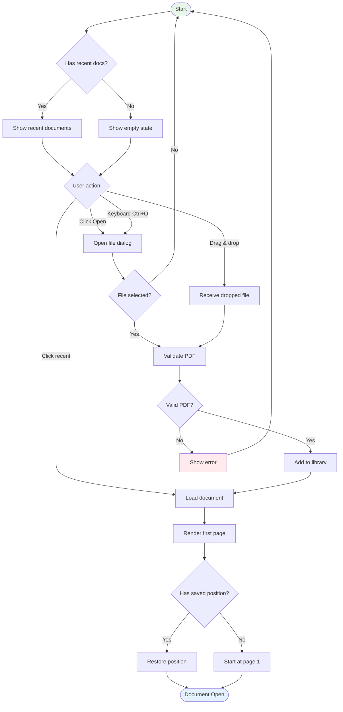
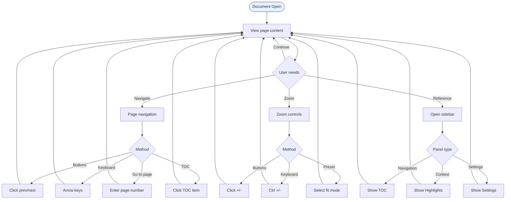
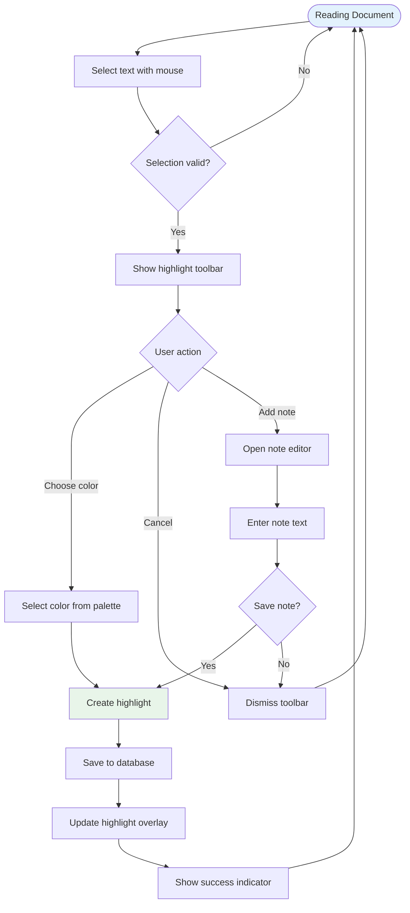
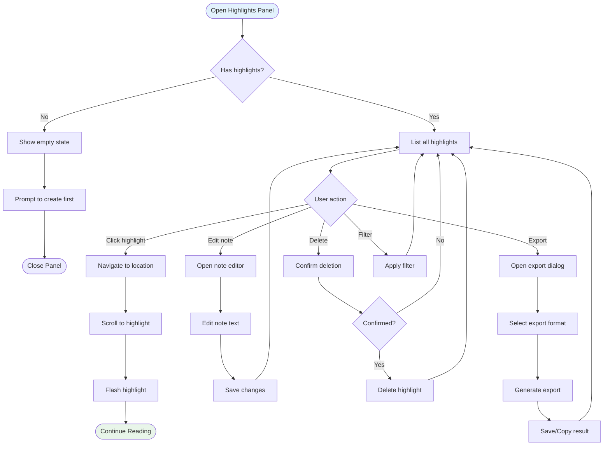
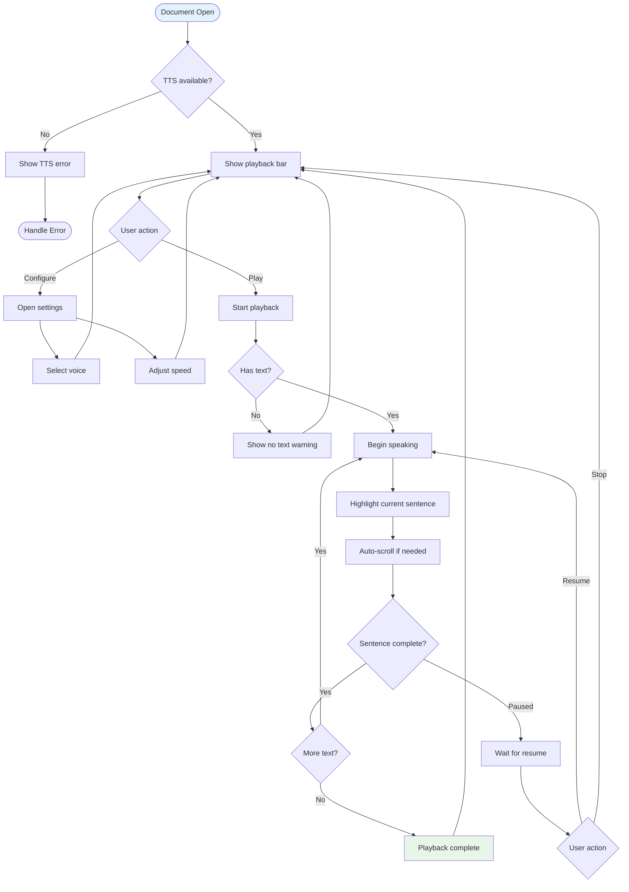
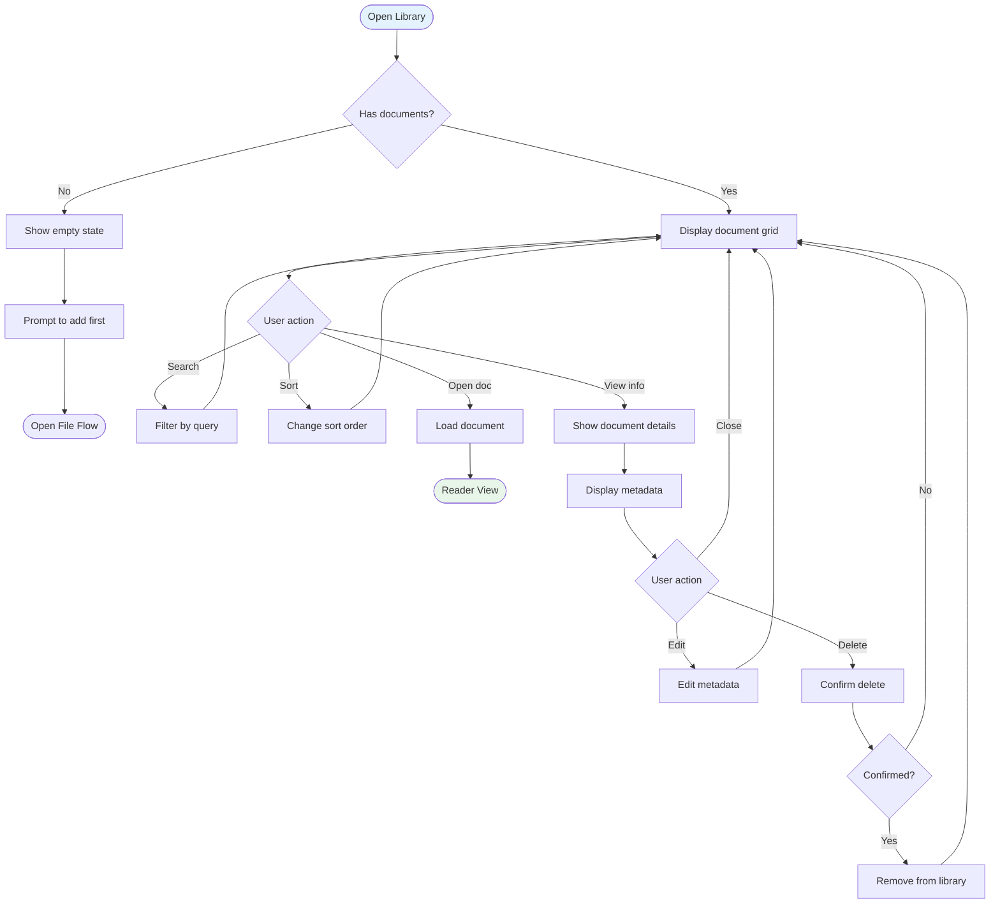
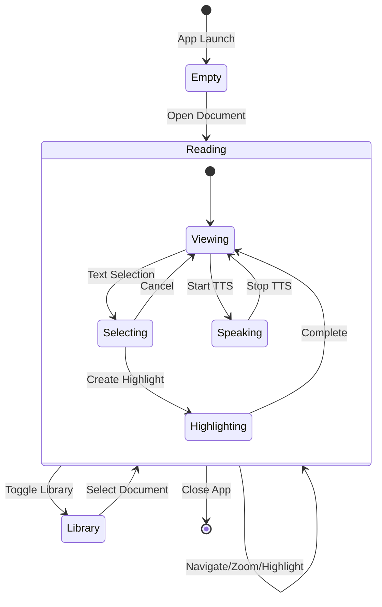
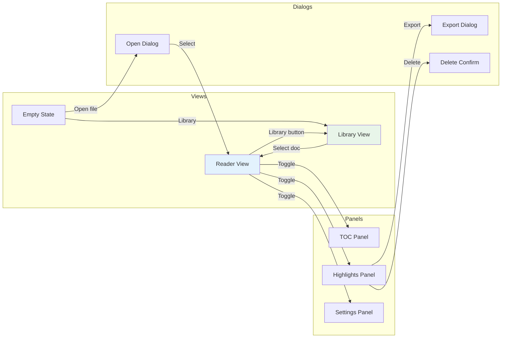

# Information Architecture: User Flows

**Feature**: 003-ui-ux-polish
**Date**: 2026-01-13
**Status**: Complete

---

## Overview

This document defines the primary user jobs, navigation model, and user flows for the Tauri PDF Reader. It serves as the foundation for UI organization and feature prioritization.

---

## Primary User Jobs

The application supports six primary user jobs that define how users interact with the system.

| # | Job | Frequency | Priority | Primary Screen |
|---|-----|-----------|----------|----------------|
| 1 | Find/Open Document | High | P0 | Reader/Library |
| 2 | Read Comfortably | Very High | P0 | Reader |
| 3 | Create Highlight | Medium | P1 | Reader |
| 4 | Navigate Highlights | Medium | P1 | Highlights Panel |
| 5 | Use TTS Playback | Medium | P1 | Reader + Playback Bar |
| 6 | Manage Library | Low | P2 | Library View |

---

## User Flow Diagrams

### 1. Find and Open Document



**Key Decisions**:
- Recent documents shown prominently
- Multiple entry points (button, keyboard, drag/drop)
- Position restoration for returning users
- Clear error states

---

### 2. Read Comfortably



**Key Decisions**:
- Multiple navigation methods supported
- Sidebars available but not required
- Keyboard shortcuts for power users
- Focus on document content

---

### 3. Create Highlight



**Key Decisions**:
- Toolbar appears near selection (context-aware)
- Color selection immediate (no dialog)
- Notes are optional
- Visual feedback on creation

---

### 4. Navigate Highlights



**Key Decisions**:
- Click-to-navigate is primary action
- Confirmation before delete
- Export supports multiple formats
- Filter by color available

---

### 5. Use TTS Playback



**Key Decisions**:
- TTS bar always visible when document open
- Sentence-level highlighting
- Auto-scroll keeps current text visible
- Clear feedback for empty/scanned pages

---

### 6. Manage Library



**Key Decisions**:
- Grid view for visual scanning
- Search by title/content
- Reading progress visible
- Delete requires confirmation

---

## Navigation Model

### Three-Column Layout

```
┌─────────────────────────────────────────────────────────────┐
│                          TOOLBAR                             │
│  [☰] [Open] Title        [Page Nav]        [Zoom] [⚙️]      │
├──────────┬──────────────────────────────────┬───────────────┤
│          │                                  │               │
│  LEFT    │           MAIN                   │    RIGHT      │
│  SIDEBAR │         CONTENT                  │    PANEL      │
│          │                                  │               │
│  - TOC   │       PDF Viewer                 │  - Highlights │
│  - Pages │                                  │  - Notes      │
│  - Library│                                 │  - Search     │
│          │                                  │               │
│  280px   │         (flex)                   │     320px     │
├──────────┴──────────────────────────────────┴───────────────┤
│                       FOOTER BAR                             │
│                    [TTS Controls]                            │
└─────────────────────────────────────────────────────────────┘
```

### Panel Purposes

| Panel | Purpose | Content |
|-------|---------|---------|
| **Left Sidebar** | Navigation | TOC, Page thumbnails, Library |
| **Main Content** | Document | PDF viewer, primary workspace |
| **Right Panel** | Context | Highlights, Notes, Search results |
| **Toolbar** | Actions | Open, Navigate, Zoom, Settings |
| **Footer** | Playback | TTS controls, progress |

### State Transitions



---

## Decision Rationale

### Why Three-Column Layout?

1. **Industry Standard**: Adobe Reader, Foxit, Calibre all use this pattern
2. **Separation of Concerns**: Navigation (left), Content (center), Context (right)
3. **Flexible**: Panels can be hidden for focused reading
4. **Scalable**: Works on various screen sizes

### Why Collapsible Panels?

1. **Focus Mode**: Users can hide panels for distraction-free reading
2. **Screen Real Estate**: Smaller screens benefit from full-width content
3. **User Preference**: Some users prefer minimal UI

### Why Footer for TTS?

1. **Persistent Access**: Always visible during playback
2. **Familiar Pattern**: Matches audio player conventions
3. **Non-intrusive**: Doesn't compete with document content

### Why Not Tabs?

1. **Parallel Access**: Users may want TOC and highlights simultaneously
2. **Context Preservation**: Panels maintain state when hidden
3. **Discoverability**: Panels are more visible than tab contents

---

## Keyboard Navigation Map

```
┌─────────────────────────────────────────────────────────────┐
│  Tab Order:                                                  │
│  1. Skip Link (optional)                                     │
│  2. Toolbar: Open → Page Nav → Zoom → Settings               │
│  3. Left Sidebar: Search → TOC items                         │
│  4. Main Content: PDF viewer                                 │
│  5. Right Panel: Panel header → List items                   │
│  6. Footer: Voice → Play/Pause → Speed                       │
└─────────────────────────────────────────────────────────────┘

Global Shortcuts:
├── Ctrl+O → Open file
├── Ctrl+W → Close document
├── Ctrl+, → Open settings
├── Ctrl+B → Toggle left sidebar
├── Ctrl+H → Toggle right panel (highlights)
├── Space → Play/Pause TTS
├── ← / → → Navigate pages
├── Ctrl++ / Ctrl+- → Zoom in/out
└── Escape → Close modal / Stop TTS
```

---

## Screen Transitions



---

## Next Steps

1. Implement navigation controls in toolbar (Phase 7)
2. Add keyboard shortcuts (Phase 7)
3. Create panel toggle components (Phase 7)
4. Test navigation flows with users
