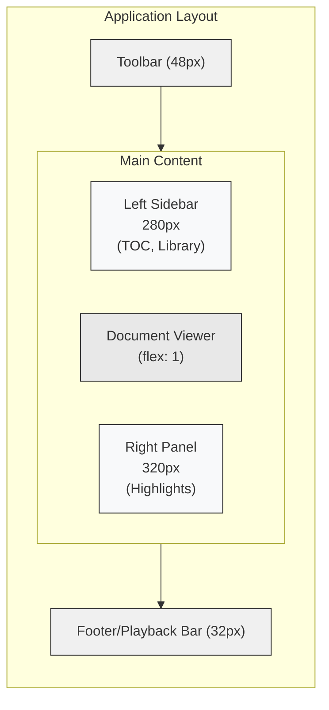
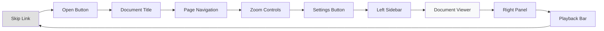

# UI Research: Document Reader Best Practices

**Feature**: 003-ui-ux-polish
**Date**: 2026-01-13
**Status**: Complete
**Source**: `specs/003-ui-ux-polish/research.md`

---

## Overview

This document compiles actionable UI/UX patterns from industry-leading document reader applications. These patterns inform the design system implementation and UX improvements for the Tauri PDF Reader.

---

## 1. Layout Patterns

### 1.1 Three-Column Layout (Recommended)

```
┌─────────────────────────────────────────────────────────────┐
│ Toolbar (48px height)                                        │
├──────────┬──────────────────────────────────┬───────────────┤
│ Left     │                                  │ Right         │
│ Sidebar  │       Document Viewer            │ Panel         │
│ 280px    │       (flex: 1)                  │ 320px         │
│          │                                  │               │
├──────────┴──────────────────────────────────┴───────────────┤
│ Footer/Status Bar (32px height)                              │
└─────────────────────────────────────────────────────────────┘
```

**Source Applications**: Adobe Acrobat, Foxit Reader, Calibre, Apple Preview

### 1.2 Sidebar Dimensions

| Element | Default | Min | Max | Notes |
|---------|---------|-----|-----|-------|
| Left Sidebar | 280px | 200px | 400px | Navigation: TOC, Library |
| Right Panel | 320px | 240px | 480px | Context: Highlights, Comments |
| Toolbar | 48px | - | - | Fixed height |
| Footer | 32px | - | - | Fixed height |

**Decision**: Use 280px/320px as defaults. These accommodate document titles without excessive truncation and provide room for annotation content.

### 1.3 Layout Visualization (Mermaid)



---

## 2. Panel Behavior Patterns

### 2.1 Collapse/Expand Animation

**Timing**: 200ms ease-out transition

```css
.panel {
  transition: width 200ms ease-out;
}

.panel.collapsed {
  width: 0;
  overflow: hidden;
}
```

**Behavior Rules**:
1. Content should not jump during animation
2. Focus moves to toggle button when panel closes
3. State persists across sessions (localStorage)
4. Panels collapse independently

### 2.2 Toggle Button States

| State | Visual | Behavior |
|-------|--------|----------|
| Default | Outline icon | Panel can be opened |
| Active | Filled icon | Panel is currently open |
| Hover | Background highlight | Visual feedback |
| Focus | Focus ring | Keyboard accessibility |

### 2.3 Panel Content Guidelines

**Left Sidebar (Navigation)**:
- Document structure (TOC/Bookmarks)
- Page thumbnails
- Search results
- Library/document list

**Right Panel (Context)**:
- Highlights/Annotations
- Comments
- Document properties
- Attachments

---

## 3. Keyboard Accessibility Patterns

### 3.1 Standard Document Reader Shortcuts

| Action | Primary Shortcut | Alternative | Notes |
|--------|-----------------|-------------|-------|
| Open file | `Ctrl+O` | - | Universal |
| Close document | `Ctrl+W` | - | Universal |
| Settings | `Ctrl+,` | - | Modern apps |
| Next page | `→` | `Page Down` | In document focus |
| Previous page | `←` | `Page Up` | In document focus |
| Go to page | `Ctrl+G` | `Ctrl+Shift+N` | Opens dialog |
| Zoom in | `Ctrl++` | `Ctrl+=` | Both supported |
| Zoom out | `Ctrl+-` | - | |
| Actual size (100%) | `Ctrl+0` | - | |
| Fit page | `Ctrl+1` | `Ctrl+Shift+H` | |
| Fit width | `Ctrl+2` | `Ctrl+Shift+W` | |
| Find | `Ctrl+F` | - | Universal |
| Find next | `F3` | `Enter` | |
| Find previous | `Shift+F3` | - | |
| Toggle sidebar | `F4` | `Ctrl+B` | |
| Toggle highlights | `Ctrl+H` | - | |
| Full screen | `F11` | - | |

### 3.2 TTS-Specific Shortcuts (Recommended)

| Action | Shortcut | Notes |
|--------|----------|-------|
| Play/Pause | `Space` | When not in text input |
| Start reading | `Ctrl+Shift+S` | From current position |
| Stop reading | `Escape` | |
| Increase speed | `Ctrl+]` | |
| Decrease speed | `Ctrl+[` | |

### 3.3 WCAG 2.2 Level A Requirements

| Criterion | Requirement | Implementation |
|-----------|-------------|----------------|
| 2.1.1 Keyboard | All functionality via keyboard | Tab navigation, Enter/Space activation |
| 2.1.2 No Trap | Focus never gets stuck | Escape closes modals, Tab wraps |
| 2.4.1 Bypass | Skip repetitive content | Landmark regions, skip links |
| 2.4.3 Focus Order | Logical navigation | Left-to-right, top-to-bottom |
| 2.4.7 Focus Visible | Always visible focus | `:focus-visible`, 2px solid ring |

### 3.4 Tab Order Convention

```
1. Skip link (if present)
2. Toolbar (left to right)
   └─ Open → Title → Page Nav → Zoom Controls
3. Left sidebar (if open)
   └─ Search → List items
4. Main document viewer
5. Right panel (if open)
   └─ Panel header → Content items
6. Footer controls
   └─ Voice → Play/Pause → Speed → Progress
```

---

## 4. TTS UI Patterns

### 4.1 Playback Control Layout

```
┌───────────────────────────────────────────────────────────┐
│  [Skip Back] [Play/Pause] [Skip Forward]  |  Speed  |  ···│
│  ══════════════════●══════════════════════════════════════│
│  00:05:32                              01:23:45           │
└───────────────────────────────────────────────────────────┘
```

**Components**:
- Play/Pause button: 32-48px, prominent center position
- Skip buttons: ±10s or ±30s navigation
- Speed control: Dropdown (0.5x, 0.75x, 1x, 1.25x, 1.5x, 2x)
- Progress bar: Full-width slider with time indicators
- Voice selector: Dropdown when multiple voices available

### 4.2 Text Highlighting During Playback

**Recommended Approach**: Sentence Highlighting

```css
.tts-highlight {
  background-color: var(--color-tts-highlight);
  border-radius: 2px;
  transition: background-color 150ms ease-out;
}
```

**Behavior**:
1. Current sentence highlighted with subtle background
2. Auto-scroll keeps highlighted text visible
3. Smooth transition when moving between sentences
4. Clear visual distinction from user highlights

**Alternative Approaches** (Not Recommended):
- Word-by-word karaoke: Too distracting for reading
- Paragraph indicator: Less precise location feedback

### 4.3 TTS State Visibility

Users should always know:
1. **Is TTS active?** - Visual indicator (icon state)
2. **Playing or paused?** - Button state change
3. **Current position?** - Progress bar + highlighted text
4. **Settings?** - Voice/speed visible in controls

---

## 5. Design System Principles

### 5.1 Token Organization

```
src/ui/tokens/
├── index.css          # Imports all token files
├── colors.css         # Semantic color tokens + dark mode
├── spacing.css        # 4px base scale
├── typography.css     # Font sizes, weights, line heights
├── radii.css          # Border radius scale
├── shadows.css        # Elevation scale
├── z-index.css        # Layer management
├── motion.css         # Duration, easing
└── layout.css         # Fixed dimensions
```

### 5.2 Color Token Layers

**Semantic tokens** (used in components):
```css
--color-text-primary: #1a1a1a;
--color-text-secondary: #666666;
--color-accent: #3b82f6;
--color-bg-surface: #f8f9fa;
```

**Component tokens** (for complex components):
```css
--button-bg: var(--color-bg-surface);
--button-height: 36px;
```

### 5.3 Spacing Scale

```
--space-1:  4px   (tight)
--space-2:  8px   (default gap)
--space-3:  12px  (medium)
--space-4:  16px  (section)
--space-6:  24px  (large)
--space-8:  32px  (panel padding)
--space-12: 48px  (page margins)
```

---

## 6. Visual Diagrams

### 6.1 Complete Layout Structure

```
┌─────────────────────────────────────────────────────────────┐
│                          TOOLBAR                             │
│  ┌─────────┐  ┌─────────────────────┐  ┌─────────────────┐  │
│  │ [Open]  │  │ ◄ Page 1/25 ►      │  │ - 100% +       │  │
│  │ Title   │  │                     │  │ [Settings]     │  │
│  └─────────┘  └─────────────────────┘  └─────────────────┘  │
├──────────┬──────────────────────────────────┬───────────────┤
│          │                                  │               │
│  SIDEBAR │        DOCUMENT VIEWER           │    PANEL      │
│          │                                  │               │
│  ┌──────┐│                                  │ ┌───────────┐ │
│  │ TOC  ││                                  │ │ Highlights│ │
│  │ ──── ││         ┌──────────────┐        │ │ ────────  │ │
│  │ Ch 1 ││         │              │        │ │ • Item 1  │ │
│  │ Ch 2 ││         │   PDF Page   │        │ │ • Item 2  │ │
│  │ Ch 3 ││         │              │        │ │ • Item 3  │ │
│  │      ││         └──────────────┘        │ │           │ │
│  └──────┘│                                  │ └───────────┘ │
│          │                                  │               │
│  280px   │         (flex: 1)                │     320px     │
├──────────┴──────────────────────────────────┴───────────────┤
│                       PLAYBACK BAR                           │
│  ┌────────┐  ┌──────────────┐  ┌─────┐  ┌────────────────┐  │
│  │ Voice  │  │ ◄◄ [▶] ►►   │  │1.0x │  │ ═══●═══════════│  │
│  └────────┘  └──────────────┘  └─────┘  └────────────────┘  │
└─────────────────────────────────────────────────────────────┘
```

### 6.2 Focus Flow Diagram (Mermaid)



---

## 7. Summary of Recommendations

| Area | Decision | Rationale |
|------|----------|-----------|
| Layout | Three-column (280px/flex/320px) | Industry standard |
| Toolbar Height | 48px | Common standard |
| Footer Height | 32px | Compact for playback |
| Panel Animation | 200ms ease-out | Smooth but responsive |
| Token System | CSS Custom Properties | Native, simple |
| TTS Highlight | Sentence background | Clear but not distracting |
| Focus Style | 2px solid ring | WCAG compliant |
| Spacing Base | 4px scale | Consistent, flexible |

---

## 8. References

1. Adobe Acrobat Keyboard Shortcuts Guide
2. WCAG 2.2 Guidelines
3. Material Design 3: Navigation Components
4. Calibre E-book Viewer Manual
5. Apple Human Interface Guidelines: Document-Based Apps
6. MDN Web Docs: CSS Custom Properties Best Practices
